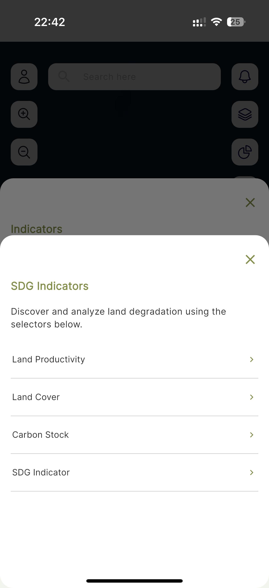
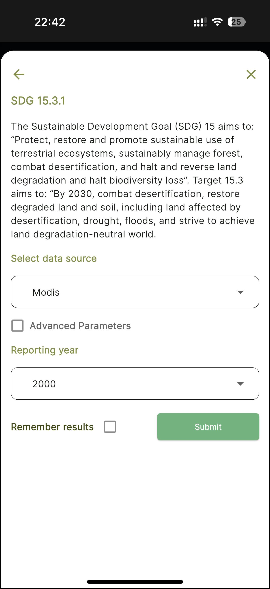

====================
SDG 15.3.1
====================

.. |layers| image:: ../../_static/mobile/buttons/layers.svg
   :height: 32px

.. |statistics| image:: ../../_static/mobile/buttons/statistics.svg
   :height: 32px

1. To start the SDG 15.3.1 analysis, click the ``Indicators`` button |layers|  to open the indicators dialog.

.. figure:: ../../_static/mobile/indicatorsModal.jpg
    :alt: Indicators dialog
    :height: 500
    :align: center

    *Indicators dialog*

2. Click the ``SDG`` button to open the SDG Indicators dialog.

    *SDG Indicators dialog*

3. Click the ``SDG Indicator`` button to open the SDG 15.3.1 dialog.

    *SDG 15.3.1 dialog*

4. Provide all the required details on the dialog and click ``submit``.
5. Visualize statistics on the dashboard by clicking the ``Statistics`` button |statistics|.