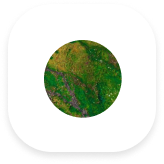
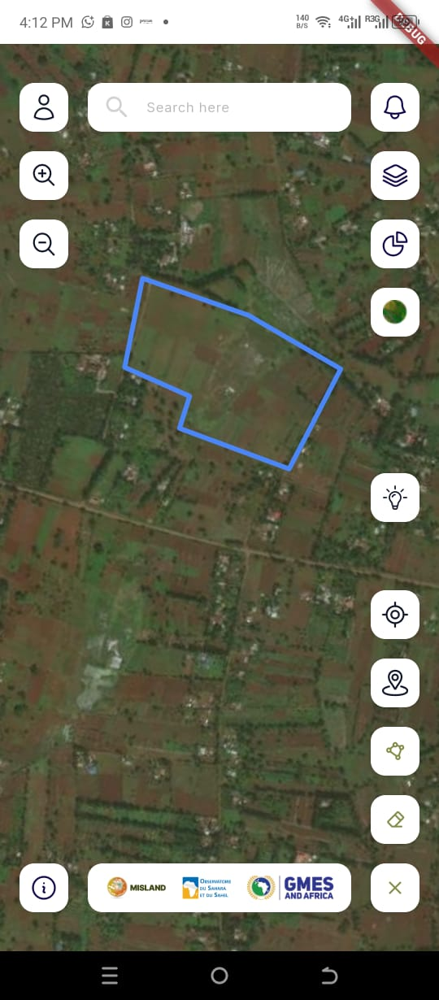
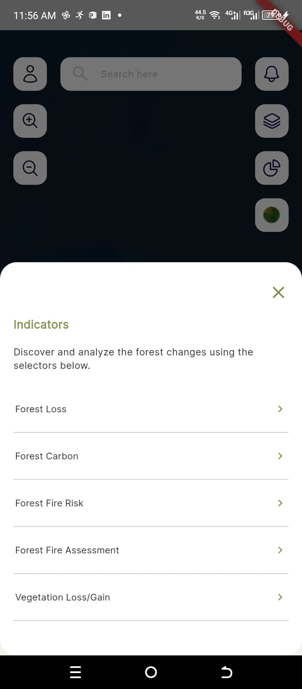
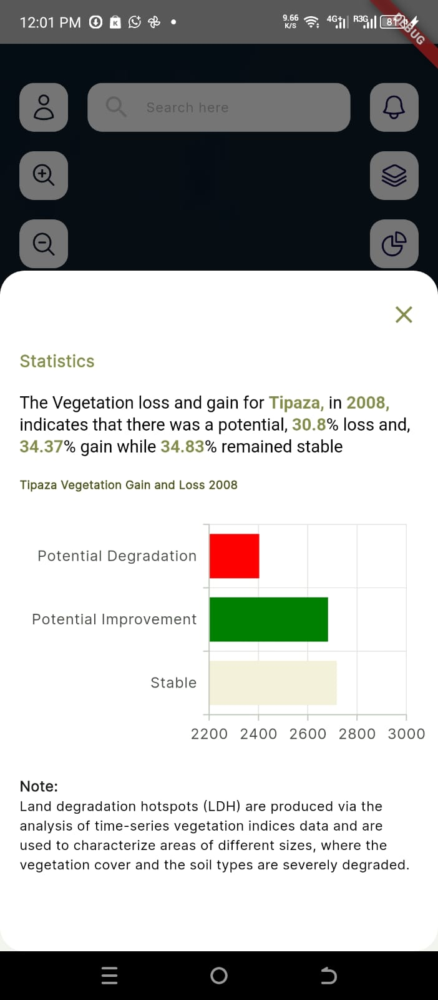

=================
Dashboard
=================

.. |tutorial| image:: ../_static/mobile/buttons/tutorial.svg
   :height: 32px

Tutorial
-----------------
To see what each button on the dashboard does, click the ``Tutorials`` button |tutorial|. This will change the dashboard's mode to 
tutorials mode labelling all buttons with what they do.

.. raw:: html

    

        

            
            
<em>Dashboard</em>

        

        

            
            
<em>Dashboard Tutorial</em>

        

    

Selecting an Area of Interest
-----------------------------
To select an area of interest, click the ``Select Location`` button |aoi|. This will open a dialog from where you can select a country, region
and subregion.

.. raw:: html

    

        

            
            
<em>AOI Dialog</em>

        

        

            
            
<em>Area of Interest</em>

        

    

Drawing a Custom Area of Interest
---------------------------------

To draw a custom area of interest, follow the procedure below.
 1. Click the ``Custom Draw`` button |customDraw|.
 2. Click the ``Draw Polygon`` button |drawPolygon| to activate drawing mode.
 3. Tap on the dashboard and a polygon will be drawn automatically with the vertices being the points you tapped on the screen.

    *Dashboard with custom AOI*

.. admonition:: Note

    To erase the polygon, click the ``Erase`` button |erase| and the polygon will be erased automatically.
    A minimum of three points is required to create a polygon.

Selecting an indicator
----------------------
To select a layer, click the ``Indicators`` button |layers| to open the indicators dialog.

    *Indicators Dialog*

.. admonition:: Note

    An area of interest must be selected before selecting an indicator.

Visulaizing statistics
-----------------------
To visualize statistics, click the ``Statistics`` button |statistics| to open the statistics dialog.

    *Statistics dialog*

.. admonition:: Note

    An indicator must have been selected before visualizing the statistics.