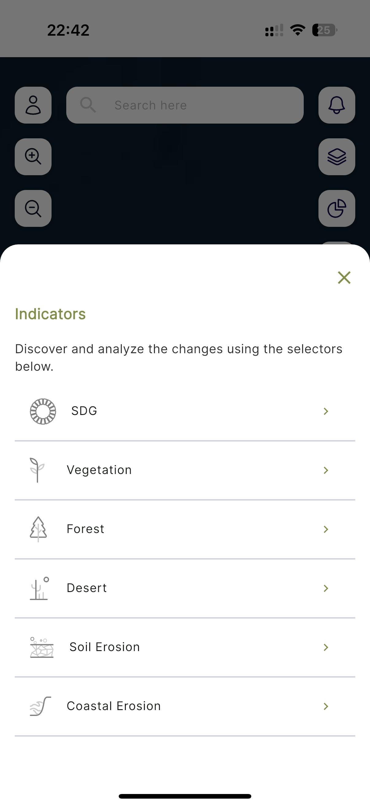

====================
Forest Loss
====================

.. |layers| image:: ../_static/mobile/buttons/layers.svg
   :height: 32px

1. To start the forest loss analysis, click the ``Indicators`` button |layers|  to open the indicators dialog.

    *Figure 16: Indicators dialog*

2. On the indicators modal click the ``Forest Loss`` button to open the forest loss dialog

.. figure:: ../_static/mobile/forestLossModal.jpg
    :alt: Forest Loss Dialog 
    :height: 500
    :align: center

    *Figure 17: Forest Loss dialog*

3. Provide all the required details on the dialog and click ``submit``.
4. Visualize statistics on the dashboard by clicking the ``Statistics`` button |statistics|.