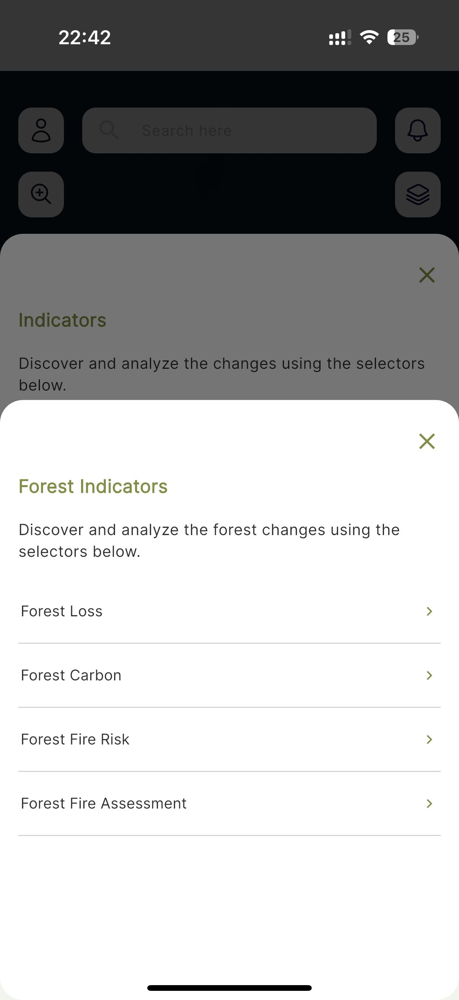

====================
Forest Carbon
====================

.. |layers| image:: ../../_static/mobile/buttons/layers.svg
   :height: 32px

.. |statistics| image:: ../../_static/mobile/buttons/statistics.svg
   :height: 32px

1. To start the forest carbon emission analysis, click the ``Indicators`` button |layers|  to open the indicators dialog.

.. figure:: ../../_static/mobile/indicatorsModal.jpg
    :alt: Indicators dialog
    :height: 500
    :align: center

    *Indicators dialog*

2. On the indicators modal click the ``Forest`` button to open the forest indicators dialog

    *Forest Indicators dialog*

3. On the indicators modal click the ``Forest Carbon`` button to open the forest carbon dialog

    *Forest carbon dialog*

4. Provide all the required details on the dialog and click ``submit``.

    *Sample Forest Carbon Result*

5. Visualize statistics on the dashboard by clicking the ``Statistics`` button |statistics|.

    *Sample Forest Carbon statistics*