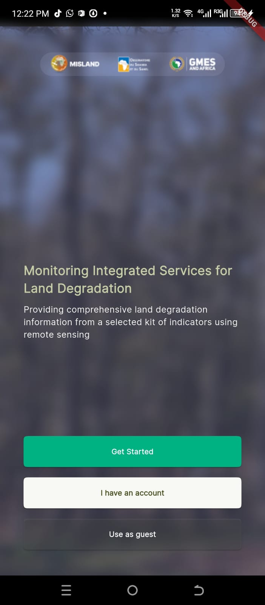
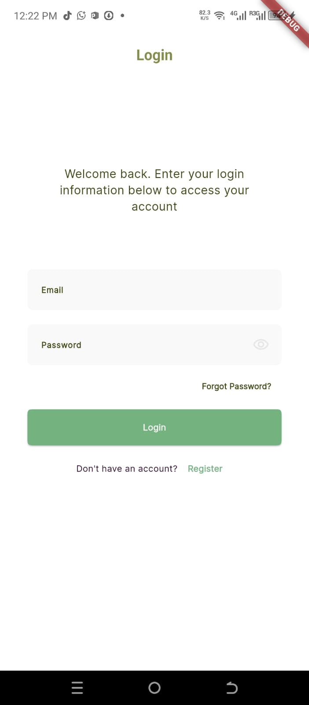

=================
User Management
=================

Like the plugin, the mobile app is free to use, but you should register an email address to facilitate computation of large areas as the results may have to be sent to the email address.
However, a ``guest`` mode is provided for those who wish to explore the app without registering or logging in.

    *Splash Screen*

Guest mode
--------------
To proceed with guest mode click ``Use as guest`` to open the dahboard without logging in or registering. 

.. admonition:: Note

    For large-area calculation, you will be required to login so that results can be sent to your email.

Login
-------------
To login, click ``I have an account`` on the splash screen to proceed to the login page.
Provide your email and password to proceed to the dashboard. If you have previously visited the `Misland Geoportal <http://misland-africa.oss-online.org/#/>`_,
or the QGIS plugin, use the same credentials to login.

    *Login*

Registration
-------------
To register an account, click ``Get started`` to open the registration page. Provide all the required details and click ``Next`` 
to proceed to the password page. Fill in your passwword and click ``Create account``. A verification email will be sent to your email
from where you can login and proceed to the dashboard.

.. raw:: html

    

        

            
            
<em>Sign up</em>

        

        

            
            
<em>Password</em>

        

    

.. admonition:: Note

    The account created here can be used both on the QGIS Plugin and the `Misland Geoportal <http://misland-africa.oss-online.org/#/>`_.

Password Retrieval
-------------------
To retrieve your account, follow the following procedure.

1. On the login page, click the ``Forgot Password`` text button to open the password reset page.
2. Provide your email and click ``Reset Password``. A verification email with a guide on how to reset your account will be sent to your email.

.. raw:: html

    

        

            
            
<em>Login</em>

        

        

            
            
<em>Password Reset</em>

        

    
