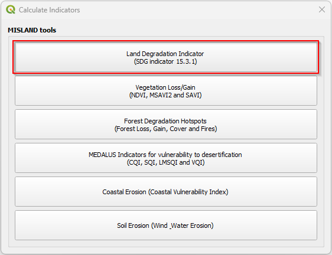
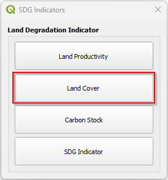
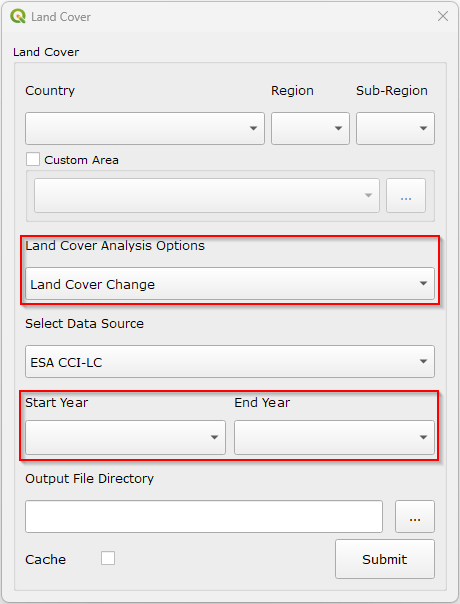

=================================
Land Cover and Land Cover Change
=================================

.. |calculate| image:: ../../_static/calculate.png
   :height: 32px

--------------
Land Cover
--------------

**1.** To start the land cover analysis, click the **calculate** icon highlighted |calculate|. This will open the **calculate** dialog.

    *Figure 10: Calculate Dialog with Land Degradation button highlighted*

**2.** From here, click on the ``Land Cover Indicator`` button highlighted in red. This will open the ``SDG Dialog``.

    *Figure 11: Land Degradation dialog*

**3.** On the dialog, click the ``Land Cover`` button highlighted in red. This will open the ``Land Cover`` dialog.

.. figure:: ../../_static/LandCover.png
    :alt: Land Cover
    :align: center

    *Figure 12: Land Cover Dialog*

**4.** On the ``Land Cover Analysis Options`` select **Land Cover**. 

.. figure:: ../../_static/LandCoverAnalysisOption.png
    :alt: Land Cover Analysis Option
    :align: center

    *Figure 13: Land Cover Analysis Option*

**5.** Provide all other parameters required in the 
dialog and click ``Submit``. The results should be displayed as shown below.

----------------------
Land Cover Change
----------------------

**1.** On the ``Land Cover`` dialog, select ``Land Cover Change`` as the ``Land Cover Analysis Option``. In this section you will have
to provide a ``Start year`` and an ``end year``. 

    *Figure 15: Land Cover Change Analysis Option*

**2.** Provide all other parameters required in the 
dialog and click ``Submit``. The results should be displayed as shown below.