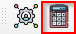
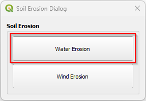
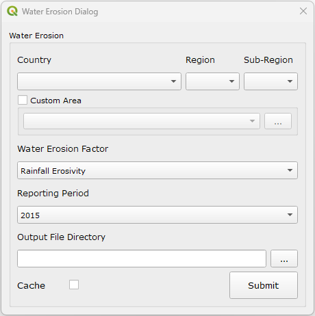
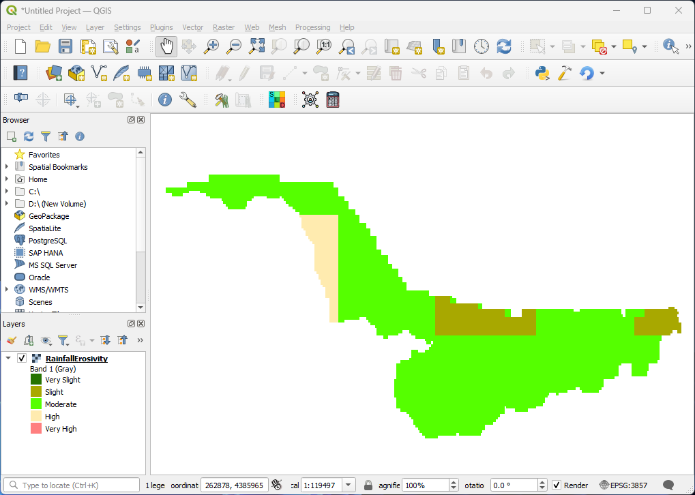

===============================
Water Erosion (RUSLE Model)
===============================

**1.** To start the water erosion analysis, click the **calculate** icon highlighted |calculate|. This will open the ``calculate`` dialog.

.. figure:: ../../_static/calculateSE.png
    :alt: Calculate Dialog.
    :align: center

    *Figure 47: Calculate Dialog*

**2.** Click on the ``Soil Erosion`` button highlighted in red to open the ``Soil Erosion Dialog``.

    *Figure 48: Soil Erosion Dialog*

**3.** Click on the ``Water Erosion`` button to open the ``Water Erosion Dialog``.
Provide all the parameters as required in the dialog and click ``Submit``.

    *Figure 49: Water Erosion Dialog*

.. important::

    .. list-table:: Water Erosion Parameters
        :width: 100%
        :widths: 25 75
        :header-rows: 1

        * - Parameters
          - Definition
        * - Water Erosion Factor
          - Water Erosion Factor
        * - Reporting Period
          - Year of analysis

**4.** The result should be as shown below.

    *Figure 50: Water Erosion Results*